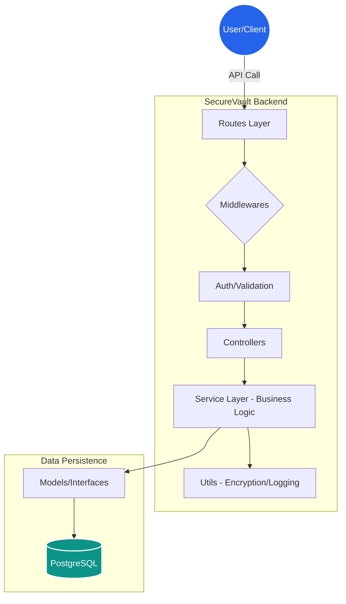

# SecureVault: Enterprise-Grade File Security API

[](https://www.typescriptlang.org/)
[](https://nodejs.org/)
[](https://www.postgresql.org/)

SecureVault is a high-performance, security-first backend built with **TypeScript** and **Node.js**. It implements industrial-grade encryption standards and a scalable layered architecture designed for production environments.

---

## System Architecture

SecureVault follows the **Controller-Service-Repository** pattern to ensure strict separation of concerns, making the codebase maintainable and testable.



 Key Architectural Pillars:
 
- Layered Security: Implementation of Helmet.js for header security and custom CORS policies.

- Schema Validation: Strict request validation using Zod to prevent malformed data.

- Type Safety: 100% TypeScript coverage to eliminate runtime errors.

Security Stack:

- This project prioritizes data privacy through:

- Authentication: Stateless JWT-based auth with specialized middleware for Role-Based Access Control (RBAC).

- Encryption at Rest: Standard-compliant AES-256-GCM for sensitive file metadata.

- Password Hashing: Utilizing Argon2 to resist GPU-based cracking.

- Rate Limiting: Protects against Brute-Force and DoS attacks on sensitive endpoints.

## Project Structure
```
src/
├── controllers/    # Express request/response handling
├── services/       # Business logic & encryption orchestration
├── models/         # TypeScript Interfaces & DB Schemas
├── middleware/     # Auth, Validation, & Error handling
├── routes/         # Typed API route definitions
├── utils/          # Shared helpers (Logger, Encryptor)
├── app.ts          # Express app configuration
└── server.ts       # Server entry point & DB connection
```
### Getting Started

#### 1. Prerequisites
* **Node.js**: v18+
* **PostgreSQL**: Local instance or cloud (Supabase/RDS)

#### 2. Installation
```bash
# Clone the repo
git clone https://github.com/pranilap123/securevault-backend.git

# Install dependencies
npm install

# Setup Environment Variables
cp .env.example .env

# Run in Development mode
npm run dev
```

📈 Roadmap

[ ] Implement Redis-based Caching for metadata lookups.

[ ] Add S3/Cloud Storage integration.

[ ] 100% Code Coverage with Vitest unit tests.

[ ] CI/CD Pipeline via GitHub Actions.


---

